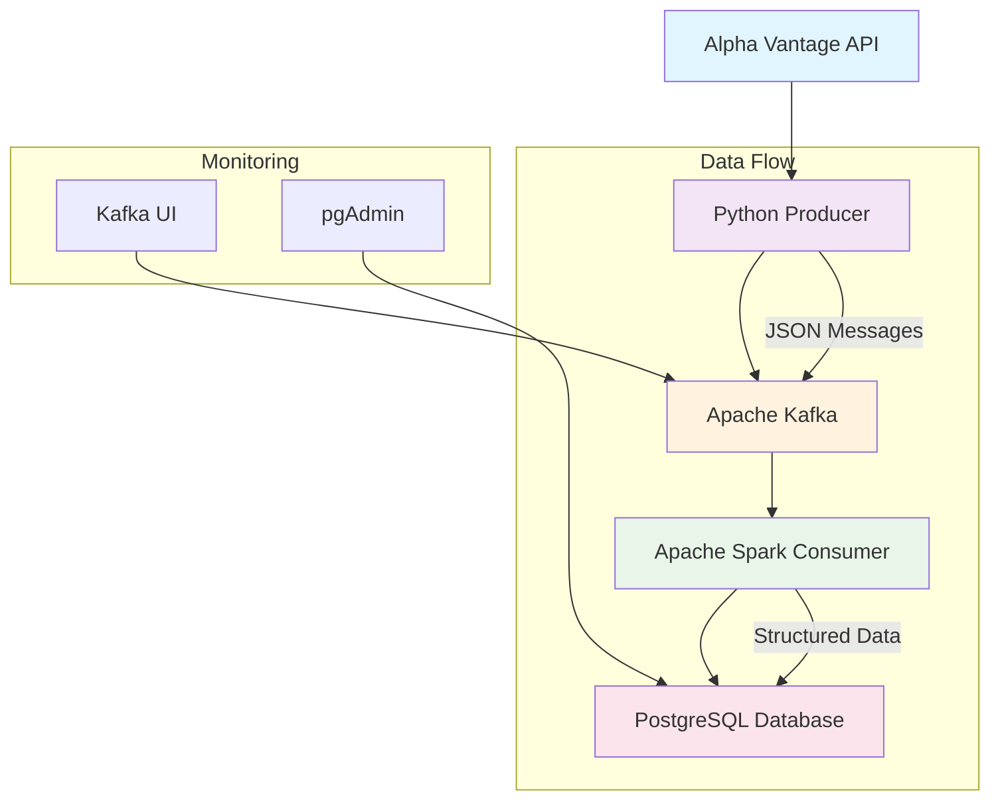

# 📈 Real-Time Stock Market Data Pipeline

[](https://www.python.org/)
[](https://www.docker.com/)
[](https://kafka.apache.org/)
[](https://spark.apache.org/)
[](https://www.postgresql.org/)

> A comprehensive data engineering project demonstrating end-to-end real-time stock market data processing using modern big data technologies.

## 📋 Table of Contents

- [🎯 Overview](#-overview)
- [✨ Features](#-features)
- [🏗️ Architecture](#️-architecture)
- [🛠️ Technology Stack](#️-technology-stack)
- [📋 Prerequisites](#-prerequisites)
- [🚀 Installation & Setup](#-installation--setup)
- [📖 Usage](#-usage)
- [📁 Project Structure](#-project-structure)
- [⚙️ Configuration](#️-configuration)
- [🔍 API Reference](#-api-reference)
- [📊 Monitoring & Visualization](#-monitoring--visualization)
- [🤝 Contributing](#-contributing)
- [📄 License](#-license)
- [🙏 Acknowledgments](#-acknowledgments)

## 🎯 Overview

This project implements a **production-ready, scalable data pipeline** for real-time stock market analytics. It showcases expertise in building distributed systems that ingest, process, and store financial data using industry-standard tools.

The pipeline extracts intraday stock data from the Alpha Vantage API, streams it through Apache Kafka, processes it with Apache Spark Structured Streaming, and persists it in PostgreSQL for downstream analytics.

**Key Highlights:**
- **Modular Architecture**: Clean separation of concerns with dedicated producer and consumer components
- **Real-time Processing**: Streaming architecture supporting micro-batch processing
- **Containerized Infrastructure**: Full Docker Compose orchestration for easy deployment
- **Fault Tolerance**: Checkpointing and error handling for reliable data processing
- **Monitoring**: Integrated UI tools for pipeline observability

## ✨ Features

### 🔄 Data Ingestion
- RESTful API integration with Alpha Vantage
- Configurable stock symbols (TSLA, MSFT, GOOGL)
- Robust error handling and retry logic
- Structured JSON data extraction

### 📡 Streaming Pipeline
- Kafka-based message queuing
- Producer-consumer decoupling
- Configurable topic management
- Message serialization/deserialization

### ⚡ Distributed Processing
- Spark Structured Streaming for real-time analytics
- Schema validation and data transformation
- Micro-batch processing with checkpointing
- JDBC connectivity for database operations

### 💾 Data Persistence
- PostgreSQL for structured data storage
- Automatic table creation and schema management
- ACID-compliant transactions
- Optimized for time-series data

### 📊 Monitoring & Observability
- Comprehensive logging with Python logging module
- Kafka UI for topic inspection
- pgAdmin for database administration
- Real-time pipeline health monitoring

## 🏗️ Architecture
(./diagrams/architecture.png)


### Component Breakdown

| Component | Technology | Responsibility |
|-----------|------------|----------------|
| **Producer** | Python + Kafka-Python | API data extraction and Kafka publishing |
| **Message Broker** | Apache Kafka | Reliable data streaming and buffering |
| **Consumer** | Apache Spark | Real-time data processing and transformation |
| **Database** | PostgreSQL | Persistent data storage with ACID guarantees |
| **Monitoring** | Kafka UI + pgAdmin | Pipeline observability and data inspection |

## 🛠️ Technology Stack

### Core Technologies
- **Python 3.8+**: Primary programming language
- **Apache Kafka 7.4.10**: Distributed streaming platform
- **Apache Spark 3.5.1**: Unified analytics engine
- **PostgreSQL 17**: Advanced open-source database

### Infrastructure & Tools
- **Docker & Docker Compose**: Containerization and orchestration
- **Kafka-Python**: Kafka client library
- **PySpark**: Python API for Spark
- **Requests**: HTTP library for API calls
- **Python-dotenv**: Environment variable management

### Development Tools
- **pgAdmin 9**: PostgreSQL administration
- **Kafka UI v0.7.2**: Kafka cluster management interface

## 📋 Prerequisites

Before running this project, ensure you have the following installed:

- **Docker & Docker Compose** (v2.0+)
- **Python 3.8+** (for local development)
- **Git** (for version control)
- **Alpha Vantage API Key** (free tier available)

### System Requirements
- **RAM**: 4GB minimum, 8GB recommended
- **Disk Space**: 5GB free space
- **Network**: Stable internet connection for API calls

## 🚀 Installation & Setup

### 1. Clone the Repository

```bash
git clone <repository-url>
cd real-stock-market-analytics
```

### 2. Environment Configuration

Create a `.env` file in the project root:

```env
API_KEY=your_alpha_vantage_api_key_here
```

> **Note**: Obtain your free API key from [Alpha Vantage](https://www.alphavantage.co/support/#api-key)

### 3. Python Environment Setup

```bash
# Create virtual environment
python -m venv venv

# Activate environment (Windows)
venv\Scripts\activate

# Install dependencies
pip install -r requirements.txt
```

### 4. Docker Infrastructure

```bash
# Start all services
docker compose up -d

# Verify services are running
docker compose ps
```

### 5. Database Initialization

The PostgreSQL container will automatically create the `stock_data` database and `stocks` table on first run.

## 📖 Usage

### Running the Data Pipeline

1. **Start Infrastructure**:
   ```bash
   docker compose up -d
   ```

2. **Run Producer**:
   ```bash
   python producer/main.py
   ```

3. **Monitor Data Flow**:
   - Kafka UI: http://localhost:8085
   - pgAdmin: http://localhost:5050
   - Spark UI: http://localhost:8081

### Sample Output

```
2024-04-15 10:30:15 - INFO - TSLA successfully loaded
2024-04-15 10:30:16 - INFO - MSFT successfully loaded
2024-04-15 10:30:17 - INFO - GOOGL successfully loaded
2024-04-15 10:30:17 - INFO - 300 records extracted
2024-04-15 10:30:17 - INFO - Data sent to stock_analysis topic
```

### Stopping the Pipeline

```bash
# Stop all services
docker compose down

# Remove volumes (optional - deletes all data)
docker compose down -v
```

## 📁 Project Structure

```
real-stock-market-analytics/
├── compose.yml                 # Docker Compose configuration
├── requirements.txt            # Python dependencies
├── consumer.py                 # Simple Kafka consumer (testing)
├── README.md                   # Project documentation
├── .env                        # Environment variables (ignored)
├── .gitignore                  # Git ignore rules
├── diagrams/
│   └── architecture.drawio     # Architecture diagram source
├── producer/
│   ├── main.py                 # Pipeline entry point
│   ├── config.py               # Configuration and logging
│   ├── extract.py              # API data extraction
│   └── producer_setup.py       # Kafka producer configuration
└── consumer/
    ├── consumer.py             # Spark streaming consumer
    └── Dockerfile              # Consumer container configuration
```

## ⚙️ Configuration

### Environment Variables

| Variable | Description | Required |
|----------|-------------|----------|
| `API_KEY` | Alpha Vantage API key | Yes |

### Kafka Configuration

- **Topic**: `stock_analysis`
- **Bootstrap Servers**: `localhost:9094` (external), `kafka:9092` (internal)
- **Auto-create Topics**: Enabled

### Spark Configuration

- **Master URL**: `spark://spark-master:7077`
- **Checkpoint Directory**: `/tmp/checkpoint/kafka_to_postgres`
- **Packages**: Kafka integration and PostgreSQL JDBC driver

### Database Configuration

- **Host**: `localhost:5434` (external), `postgres:5432` (internal)
- **Database**: `stock_data`
- **User**: `admin`
- **Password**: `admin`
- **Table**: `stocks`

## 🔍 API Reference

### Alpha Vantage Integration

**Endpoint**: `https://alpha-vantage.p.rapidapi.com/query`

**Parameters**:
- `function`: `TIME_SERIES_INTRADAY`
- `symbol`: Stock ticker (TSLA, MSFT, GOOGL)
- `interval`: `5min`
- `outputsize`: `compact`

**Response Structure**:
```json
{
  "Meta Data": {
    "2. Symbol": "TSLA"
  },
  "Time Series (5min)": {
    "2024-04-15 16:00:00": {
      "1. open": "189.50",
      "2. high": "190.25",
      "3. low": "188.80",
      "4. close": "189.90"
    }
  }
}
```

### Kafka Message Schema

```json
{
  "date": "2024-04-15 16:00:00",
  "symbol": "TSLA",
  "open": "189.50",
  "high": "190.25",
  "low": "188.80",
  "close": "189.90"
}
```

## 📊 Monitoring & Visualization

### Kafka UI (localhost:8085)
- View topics and messages
- Monitor consumer groups
- Inspect message contents
- Check broker health

### pgAdmin (localhost:5050)
- Query the `stocks` table
- View table schemas
- Execute custom SQL
- Monitor database performance

### Spark UI (localhost:8081)
- Monitor active jobs
- View streaming statistics
- Check executor status
- Analyze performance metrics

## 🤝 Contributing

Contributions are welcome! Please follow these steps:

1. Fork the repository
2. Create a feature branch (`git checkout -b feature/amazing-feature`)
3. Commit your changes (`git commit -m 'Add amazing feature'`)
4. Push to the branch (`git push origin feature/amazing-feature`)
5. Open a Pull Request

### Development Guidelines

- Follow PEP 8 style guidelines
- Add tests for new features
- Update documentation as needed
- Ensure Docker compatibility

## 📄 License

This project is licensed under the MIT License - see the [LICENSE](LICENSE) file for details.

## 🙏 Acknowledgments

- **Alpha Vantage** for providing free financial market data APIs
- **Apache Foundation** for Kafka and Spark projects
- **Docker** for containerization technology
- **PostgreSQL** for robust database solutions

---

**Built with ❤️ for data engineering excellence**

*Showcase your skills in distributed systems, real-time processing, and modern data architecture*