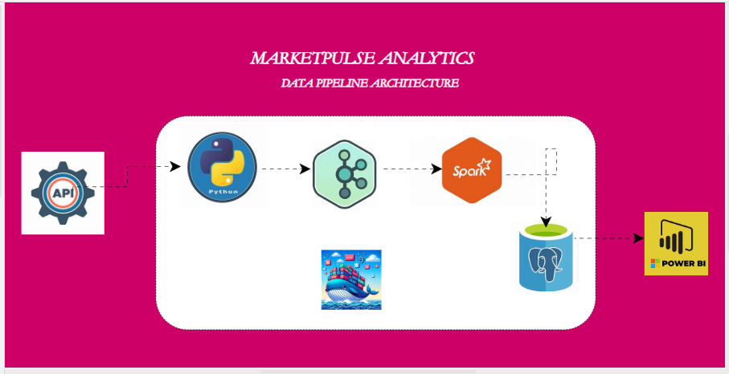

# Real-Time Stock Market Data Pipeline
## Data Pipeline Architecture

## Overview

This project implements a modular data engineering pipeline designed to extract real-time stock market data from the Alpha Vantage API and prepare it for distributed processing and analytics.

The system demonstrates how modern data platforms integrate API ingestion, data streaming, distributed computation, and persistent storage using containerised infrastructure.

This project is built as a learning exercise in **data engineering architecture**, focusing on scalable pipelines and modular design.

---

## Learning Objectives

This project demonstrates practical experience with:

- modular Python pipeline design
- API data ingestion
- containerised data infrastructure
- distributed data processing architecture
- streaming data pipelines

---
## Architecture

The pipeline is designed to support a streaming data architecture using the following components:

- **Python Producer** – Extracts stock market data from the Alpha Vantage API
- **Apache Kafka** – Handles real-time data streaming
- **Apache Spark** – Performs distributed data processing
- **PostgreSQL** – Stores processed stock data
- **pgAdmin** – Database administration interface
- **Docker Compose** – Container orchestration

### producer/

Contains the Python producer pipeline responsible for extracting and preparing stock market data.

**config.py**

Handles:

- environment variable loading
- API configuration
- logging configuration

**extract.py**

Responsible for:

- connecting to the Alpha Vantage API
- retrieving time-series stock data
- extracting and structuring the JSON response

**main.py**

Pipeline entry point that:

- triggers API extraction
- processes returned records
- logs pipeline status

---

##  How It Works (End-to-End Flow)

### 1. Data Ingestion (Producer)

The pipeline starts in `producer/main.py`.

- Connects to Alpha Vantage API
- Extracts intraday stock data for:
  - TSLA
  - MSFT
  - GOOGL
- Transforms API response into structured records
- Sends records to Kafka topic: `stock_analysis`

This is where the “stream” begins even though the API is batch, I simulate streaming using delays.

---

### 2. Kafka (Streaming Layer)

Kafka acts as the **message broker**:

- Receives stock data from producer
- Buffers and streams data to consumers
- Enables decoupling between ingestion and processing

---

### 3. Spark Consumer (Processing Layer)

Inside the containerized Spark job:

- Reads streaming data from Kafka
- Parses JSON into structured schema
- Applies light transformations
- Converts timestamps properly
- Writes data in micro-batches

This uses **Spark Structured Streaming**, not batch Spark.

---

### 4. Data Storage (PostgreSQL)

- Processed data is written into a `stocks` table
- Uses JDBC sink inside Spark
- Supports continuous streaming inserts

---

### 5. Monitoring (pgAdmin + Kafka UI)

- **Kafka UI** → inspect messages and topics  
- **pgAdmin** → query stored data  

---

## Logging

The pipeline uses Python’s logging module to track pipeline activity.

Example output:
2026-03-17 02:09:33 - INFO - TSLA successfully loaded
2026-03-17 02:09:34 - INFO - MSFT successfully loaded
2026-03-17 02:09:34 - INFO - GOOGL successfully loaded
2026-03-17 02:09:34 - INFO - 200 records extracted
2026-03-17 02:09:34 - INFO - TSLA data successfully processed
2026-03-17 02:09:34 - INFO - MSFT data successfully processed
2026-03-17 02:09:34 - INFO - GOOGL data successfully processed

---

## Installations and Application Setup

This project required setting up both local Python dependencies and containerised services.

---

### 1. Local Python Setup

I created a virtual environment and installed the Python packages needed for the producer.

### 2. Create virtual environment

python -m venv venv

### 3. Activate virtual environment
venv\scripts\activate

### 4. Run the producer
python producer/main.py

Start the infrastructure:
docker compose -d

Stop the stack:
docker compose down

---

## Environment Variables

Create a `.env` file in the project root.

Example:
API_KEY= the key you got from your API website
